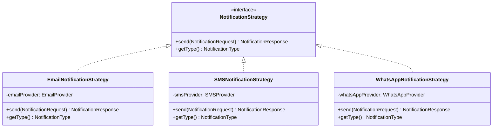
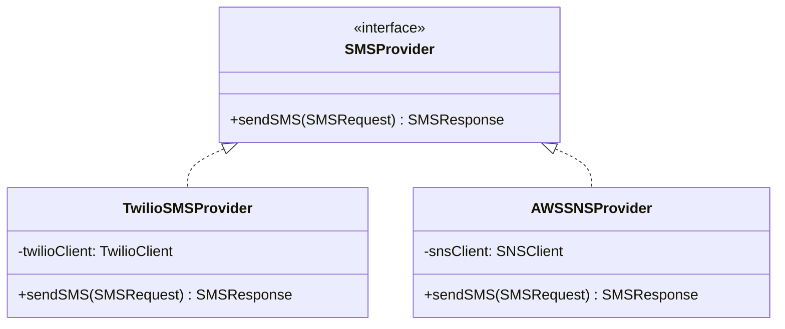
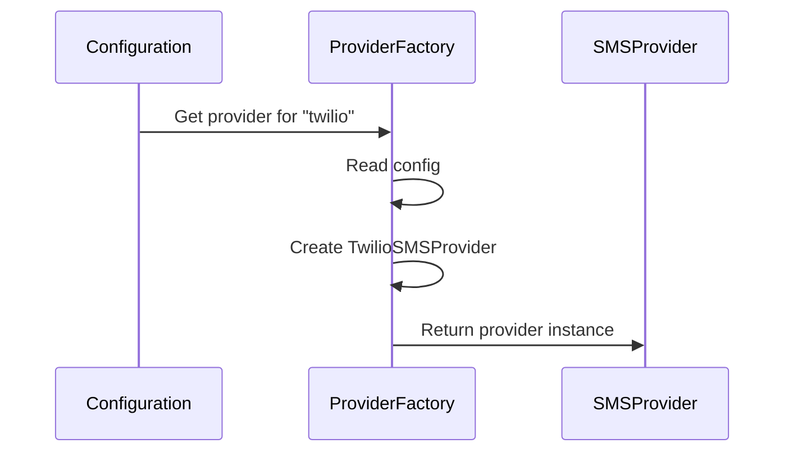
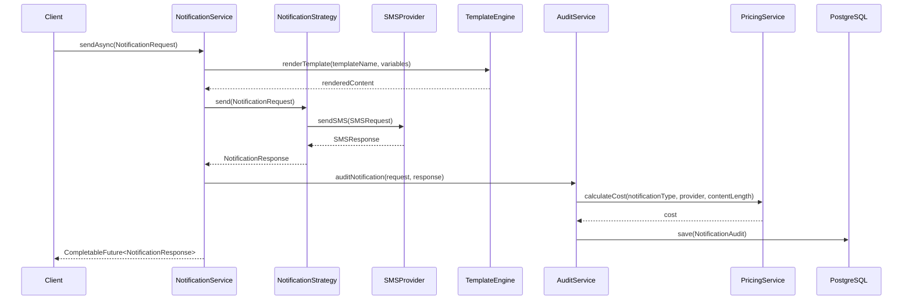
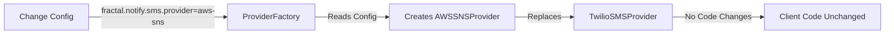
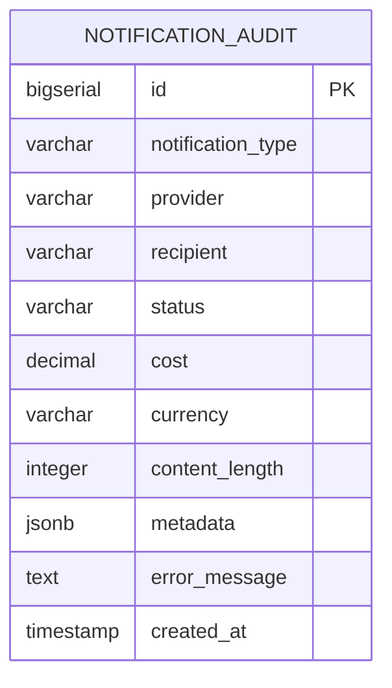
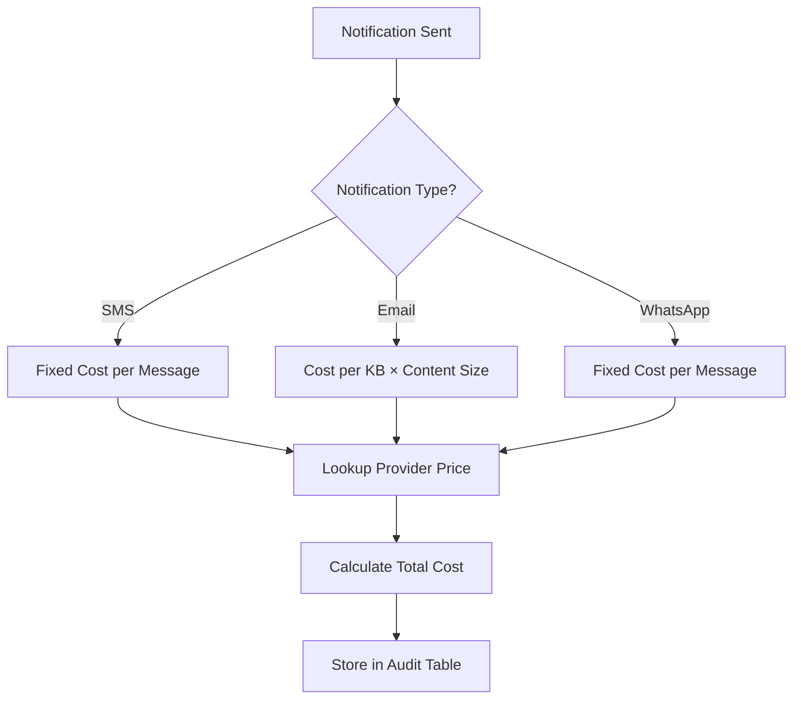

# Fractal Notification Engine
## Architecture & Design Document

---

## Table of Contents

1. [Executive Summary](#executive-summary)
2. [Architecture Overview](#architecture-overview)
3. [Design Patterns](#design-patterns)
4. [System Components](#system-components)
5. [Data Flow](#data-flow)
6. [Auditing & Pricing](#auditing--pricing)
7. [Configuration Guide](#configuration-guide)
8. [Usage Examples](#usage-examples)
9. [Extensibility](#extensibility)

---

## Executive Summary

The **Fractal Notification Engine** is a reusable Spring Boot starter that provides a unified interface for sending notifications across multiple channels (Email, SMS, WhatsApp). Built with extensibility in mind, it allows easy swapping of notification providers without code changes, making it ideal for production environments where provider flexibility is crucial.

### Key Features

- **Multi-Channel Support**: Email, SMS, WhatsApp (extensible)
- **Provider Agnostic**: Switch providers via configuration (e.g., Twilio → AWS SNS)
- **Template Engine**: Thymeleaf-based templating for dynamic content
- **Async Processing**: Non-blocking notification delivery
- **Audit & Pricing**: PostgreSQL-based tracking with automatic cost calculation
- **Spring Boot Starter**: Auto-configuration for easy integration

---

## Design Patterns

### 1. Strategy Pattern

**Purpose**: Encapsulate different notification algorithms (Email, SMS, WhatsApp) and make them interchangeable.



**Benefits**:
- Easy to add new notification types
- Client code doesn't need to know specific implementation
- Each strategy can have its own logic

### 2. Provider Pattern

**Purpose**: Allow multiple implementations for the same notification type (e.g., Twilio SMS vs AWS SNS SMS).



**Benefits**:
- Swap providers via configuration (no code changes)
- Test with mock providers
- Support multiple providers simultaneously

### 3. Factory Pattern

**Purpose**: Create appropriate provider instances based on configuration.



---

## System Components

### Core Components

#### 1. NotificationService
- **Role**: Main facade for sending notifications
- **Responsibilities**:
  - Route requests to appropriate strategy
  - Handle async processing
  - Integrate template engine
  - Trigger audit logging

#### 2. NotificationStrategy
- **Role**: Interface for notification type implementations
- **Implementations**: EmailNotificationStrategy, SMSNotificationStrategy, WhatsAppNotificationStrategy

#### 3. Provider Interfaces
- **EmailProvider**: SMTPEmailProvider, SendGridEmailProvider
- **SMSProvider**: TwilioSMSProvider, AWSSNSProvider
- **WhatsAppProvider**: (Future implementations)

### Supporting Components

#### 4. TemplateEngine
- **Technology**: Thymeleaf
- **Purpose**: Render dynamic templates with variables
- **Location**: `resources/templates/{type}/{templateName}.html`

#### 5. AsyncNotificationProcessor
- **Technology**: Spring `@Async`
- **Purpose**: Non-blocking notification delivery
- **Configuration**: Configurable thread pool size

#### 6. NotificationAuditService
- **Role**: Audit logging service
- **Responsibilities**:
  - Record all notification attempts
  - Calculate costs via PricingService
  - Store audit records in PostgreSQL

#### 7. PricingService
- **Role**: Cost calculation engine
- **Calculation Rules**:
  - SMS: Fixed cost per message (provider-specific)
  - Email: Cost per KB of content
  - WhatsApp: Fixed cost per message

---

## Data Flow

### Notification Sending Flow



### Provider Switching Flow



---

## Auditing & Pricing

### Audit Entity Structure



### Database Schema

```sql
CREATE TABLE notification_audit (
    id BIGSERIAL PRIMARY KEY,
    notification_type VARCHAR(50) NOT NULL,
    provider VARCHAR(100) NOT NULL,
    recipient VARCHAR(255) NOT NULL,
    status VARCHAR(20) NOT NULL, -- SUCCESS, FAILED
    cost DECIMAL(10, 6) NOT NULL,
    currency VARCHAR(3) DEFAULT 'USD',
    content_length INTEGER,
    metadata JSONB,
    error_message TEXT,
    created_at TIMESTAMP DEFAULT CURRENT_TIMESTAMP
);

-- Indexes for efficient queries
CREATE INDEX idx_created_at ON notification_audit(created_at);
CREATE INDEX idx_notification_type ON notification_audit(notification_type);
CREATE INDEX idx_provider ON notification_audit(provider);
CREATE INDEX idx_status ON notification_audit(status);
```

### Cost Calculation Flow



### Pricing Examples

| Notification Type | Provider | Pricing Model | Example Cost |
|------------------|----------|---------------|--------------|
| SMS | Twilio | $0.005 per message | 100 SMS = $0.50 |
| SMS | AWS SNS | $0.006 per message | 100 SMS = $0.60 |
| Email | SMTP | $0.0001 per KB | 5 KB email = $0.0005 |
| Email | SendGrid | $0.0002 per KB | 5 KB email = $0.001 |
| WhatsApp | Default | $0.01 per message | 100 messages = $1.00 |

---

## Configuration Guide

### Application Configuration

```yaml
fractal:
  notify:
    enabled: true
    async:
      enabled: true
      core-pool-size: 5
      max-pool-size: 10
      queue-capacity: 100
    
    # Email Configuration
    email:
      provider: smtp  # Options: smtp, sendgrid
      smtp:
        host: smtp.gmail.com
        port: 587
        username: ${EMAIL_USERNAME}
        password: ${EMAIL_PASSWORD}
        from: noreply@company.com
    
    # SMS Configuration
    sms:
      provider: twilio  # Options: twilio, aws-sns
      twilio:
        account-sid: ${TWILIO_ACCOUNT_SID}
        auth-token: ${TWILIO_AUTH_TOKEN}
        from-number: ${TWILIO_FROM_NUMBER}
    
    # WhatsApp Configuration (Future)
    whatsapp:
      provider: default
      enabled: false
    
    # Pricing Configuration
    pricing:
      sms:
        twilio: 0.005      # $0.005 per SMS
        aws-sns: 0.006     # $0.006 per SMS
      email:
        smtp: 0.0001       # $0.0001 per KB
        sendgrid: 0.0002   # $0.0002 per KB
      whatsapp:
        default: 0.01      # $0.01 per message
      currency: USD
    
    # Audit Configuration
    audit:
      enabled: true
      datasource:
        url: ${DATABASE_URL}
        username: ${DB_USERNAME}
        password: ${DB_PASSWORD}
        driver-class-name: org.postgresql.Driver
```

### Switching Providers

To switch from Twilio to AWS SNS:

```yaml
fractal:
  notify:
    sms:
      provider: aws-sns  # Changed from 'twilio'
    pricing:
      sms:
        aws-sns: 0.006   # Update pricing
```

**No code changes required!**

---

## Usage Examples

### Basic Email Notification

```java
@Autowired
private NotificationService notificationService;

public void sendWelcomeEmail(String email, String name) {
    NotificationRequest request = NotificationRequest.builder()
        .notificationType(NotificationType.EMAIL)
        .to(email)
        .subject("Welcome to Our Platform")
        .templateName("welcome")
        .templateVariables(Map.of(
            "name", name,
            "company", "Fractal"
        ))
        .build();
    
    notificationService.sendAsync(request);
}
```

### SMS Notification

```java
public void sendOTP(String phoneNumber, String otp) {
    NotificationRequest request = NotificationRequest.builder()
        .notificationType(NotificationType.SMS)
        .to(phoneNumber)
        .body("Your OTP is: " + otp)
        .build();
    
    CompletableFuture<NotificationResponse> future = 
        notificationService.sendAsync(request);
    
    future.thenAccept(response -> {
        if (response.isSuccess()) {
            log.info("OTP sent successfully");
        }
    });
}
```

### Querying Audit Data

```java
@Autowired
private NotificationAuditRepository auditRepository;

// Get total cost for last month
public BigDecimal getMonthlyCost() {
    LocalDateTime start = LocalDateTime.now().minusMonths(1);
    LocalDateTime end = LocalDateTime.now();
    return auditRepository.findTotalCostByDateRange(start, end);
}

// Get cost breakdown by notification type
public Map<NotificationType, BigDecimal> getCostByType() {
    return auditRepository.findCostByNotificationType();
}

// Get cost breakdown by provider
public Map<String, BigDecimal> getCostByProvider() {
    return auditRepository.findCostByProvider();
}
```

---

## Extensibility

### Adding a New Notification Type

1. Create strategy class implementing `NotificationStrategy`
2. Create provider interface (e.g., `PushNotificationProvider`)
3. Implement provider(s) (e.g., `FCMProvider`, `APNSProvider`)
4. Register in `NotificationProviderFactory`
5. Add pricing configuration

### Adding a New Provider

1. Implement the provider interface (e.g., `SMSProvider`)
2. Register in `NotificationProviderFactory`
3. Add configuration properties
4. Add pricing configuration

**Example**: Adding AWS SNS SMS Provider

```java
@Component
public class AWSSNSProvider implements SMSProvider {
    @Override
    public SMSResponse sendSMS(SMSRequest request) {
        // AWS SNS implementation
    }
}
```

```yaml
fractal:
  notify:
    sms:
      provider: aws-sns  # Now available
    pricing:
      sms:
        aws-sns: 0.006
```

---

## Project Structure

```
fractal-notify/
├── src/main/java/com/fractal/notify/
│   ├── config/
│   │   ├── NotificationAutoConfiguration.java
│   │   └── NotificationProperties.java
│   ├── core/
│   │   ├── NotificationService.java
│   │   ├── NotificationStrategy.java
│   │   ├── NotificationRequest.java
│   │   ├── NotificationResponse.java
│   │   └── NotificationType.java
│   ├── email/
│   │   ├── EmailNotificationStrategy.java
│   │   ├── EmailProvider.java
│   │   ├── provider/
│   │   │   └── SMTPEmailProvider.java
│   │   └── dto/
│   │       └── EmailRequest.java
│   ├── sms/
│   │   ├── SMSNotificationStrategy.java
│   │   ├── SMSProvider.java
│   │   ├── provider/
│   │   │   └── TwilioSMSProvider.java
│   │   └── dto/
│   │       └── SMSRequest.java
│   ├── whatsapp/
│   │   ├── WhatsAppNotificationStrategy.java
│   │   ├── WhatsAppProvider.java
│   │   └── dto/
│   │       └── WhatsAppRequest.java
│   ├── template/
│   │   ├── TemplateEngine.java
│   │   └── TemplateService.java
│   ├── async/
│   │   └── AsyncNotificationProcessor.java
│   └── audit/
│       ├── NotificationAuditService.java
│       ├── PricingService.java
│       ├── entity/
│       │   └── NotificationAudit.java
│       └── repository/
│           └── NotificationAuditRepository.java
├── src/main/resources/
│   ├── META-INF/
│   │   └── spring.factories
│   └── templates/
│       └── email/
│           └── welcome.html
└── pom.xml
```

---

## Key Benefits

### 1. Provider Flexibility
- Switch providers via configuration
- No code changes required
- Support multiple providers simultaneously

### 2. Cost Transparency
- Automatic cost calculation
- Historical audit trail
- Cost analysis by type/provider

### 3. Extensibility
- Add new notification types easily
- Add new providers without modifying existing code
- Follows Open/Closed Principle

### 4. Production Ready
- Async processing for performance
- Comprehensive error handling
- Audit trail for compliance

### 5. Developer Experience
- Simple API for clients
- Auto-configuration
- Template support for dynamic content

---

## Future Enhancements

1. **Delivery Status Tracking**: Track delivery status and update audit records
2. **Retry Mechanism**: Automatic retry for failed notifications
3. **Rate Limiting**: Cost-based rate limiting
4. **Analytics Dashboard**: REST endpoints for cost reporting
5. **Webhook Support**: Provider webhook integration for delivery status
6. **Multi-tenancy**: Support for multiple organizations with separate billing

---

## Conclusion

The Fractal Notification Engine provides a robust, extensible solution for multi-channel notifications with built-in auditing and cost tracking. Its design patterns ensure easy maintenance and provider flexibility, making it ideal for production environments where requirements may change over time.

---

**Document Version**: 1.0  
**Last Updated**: 2024  
**Author**: Fractal Engineering Team
